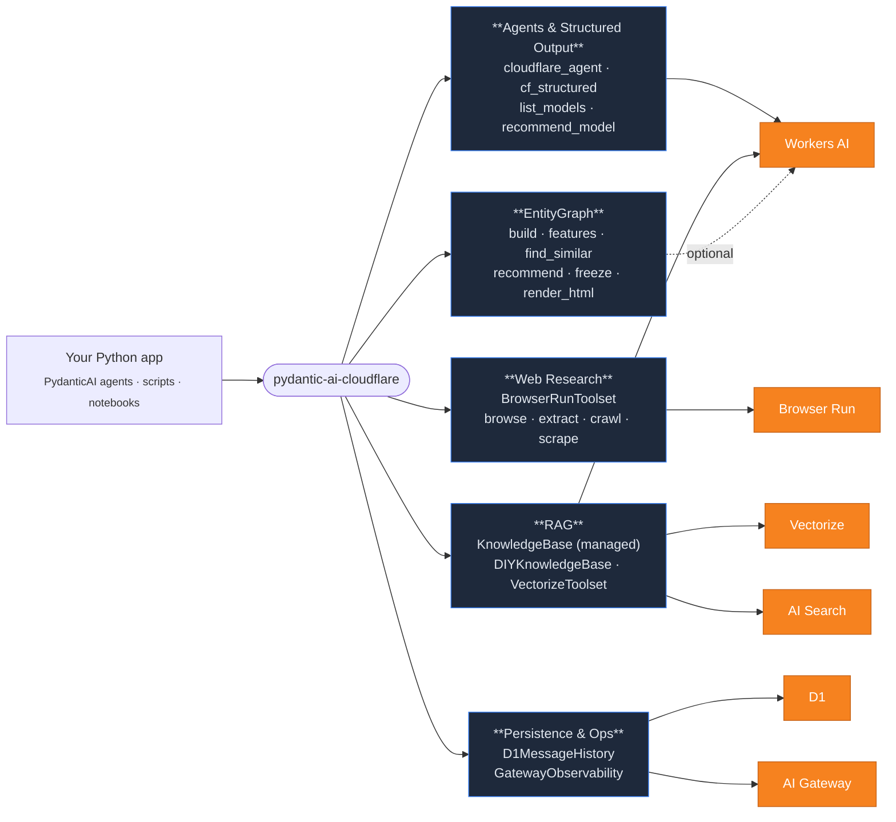
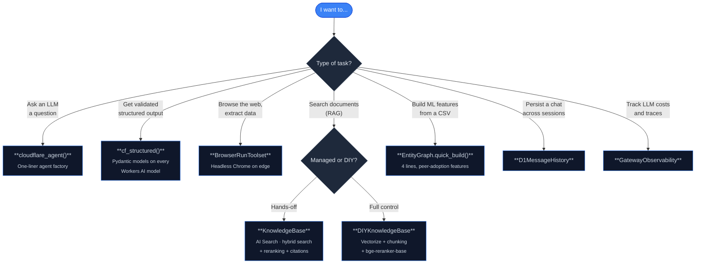
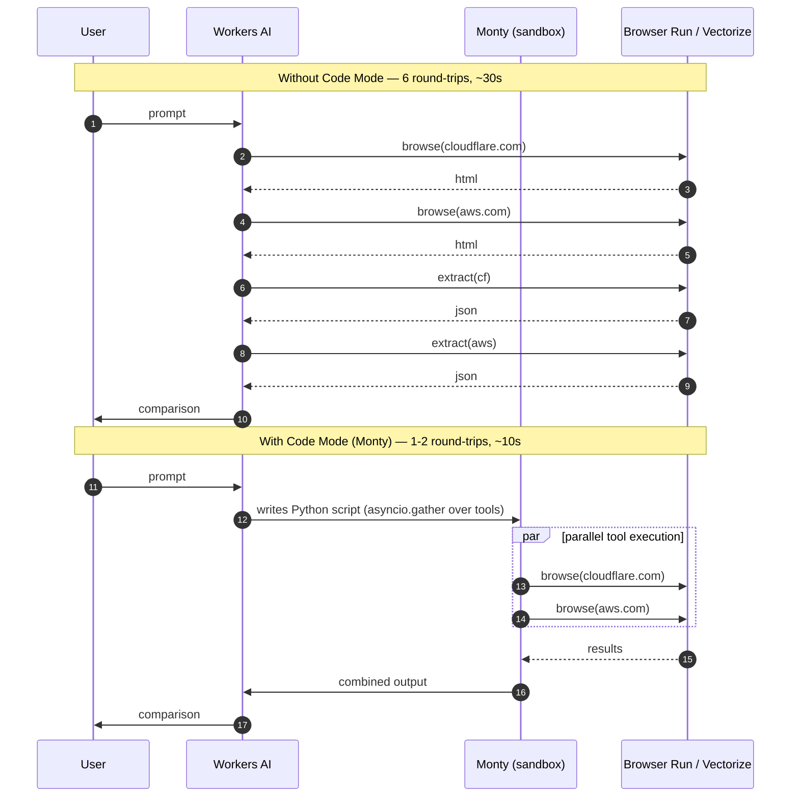
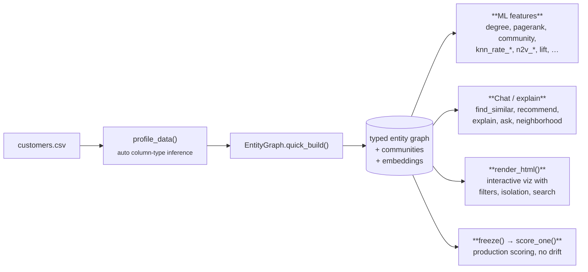
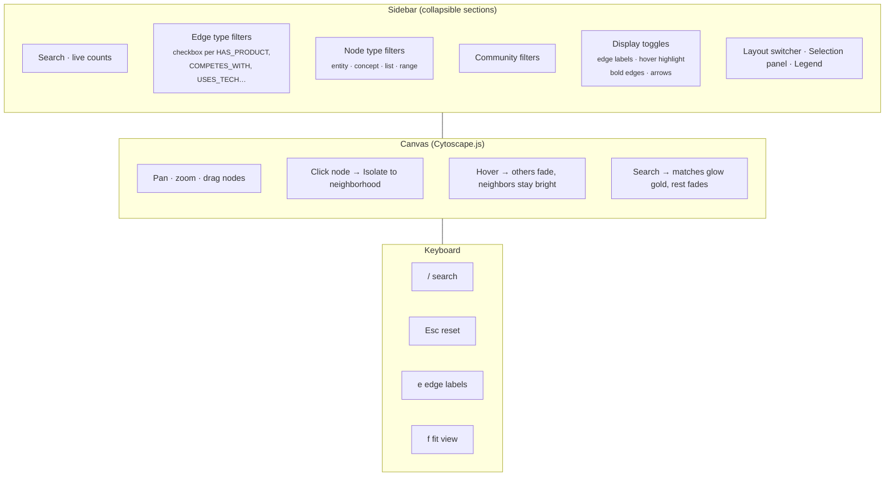

# pydantic-ai-cloudflare

**One Python toolkit for the entire Cloudflare AI stack — structured output, web research, RAG, knowledge graphs, persistence, and observability — wired into PydanticAI.**

[](https://pypi.org/project/pydantic-ai-cloudflare/)
[](https://pypi.org/project/pydantic-ai-cloudflare/)
[](LICENSE)
[](tests/)
[](https://github.com/vamshi694/pydantic-ai-cloudflare/actions/workflows/semgrep.yml)
[](https://github.com/vamshi694/pydantic-ai-cloudflare/actions/workflows/pip-audit.yml)

```bash
pip install pydantic-ai-cloudflare
```

```python
from pydantic_ai_cloudflare import cloudflare_agent, EntityGraph, KnowledgeBase
```

---

## Why this library?

Cloudflare has built a complete AI platform — Workers AI (20+ models), Browser Run, Vectorize, AI Search, AI Gateway, D1 — all with generous free tiers and edge latency. **There was no Python SDK that connected it to PydanticAI**, so building agents on Cloudflare meant duct-taping HTTP calls, normalizing model quirks by hand, and writing your own RAG pipeline.

This library closes that gap with **type-safe, batteries-included primitives** for the four things people actually build:

1. **Agents & structured output** that works reliably on every Workers AI model
2. **Web research** with the Browser Run toolset (browse, extract, crawl, scrape)
3. **RAG** — both managed (AI Search) and DIY (Vectorize + reranking)
4. **Entity graphs from tabular data** — peer-adoption ML features, relationships, interactive visualization

Plus persistence (D1), observability (AI Gateway), and a model catalog with recommendations.

---

## Architecture



The orange nodes are Cloudflare services. The blue boxes are this library's primitives that wrap them with type safety, response normalization, and convenience APIs.

---

## Choose your starting point



---

## Five-minute tour

```python
from pydantic_ai_cloudflare import (
    cloudflare_agent, cf_structured_sync,
    BrowserRunToolset, KnowledgeBase, EntityGraph,
    GatewayObservability,
)
from pydantic import BaseModel
```

#### 1. Agent with structured output

```python
class Company(BaseModel):
    name: str
    industry: str
    headcount: int

result = cf_structured_sync(
    "NovaPay is a 200-person fintech in NYC",
    Company,
    model="@cf/qwen/qwen3-30b-a3b-fp8",
)
print(result.name, result.industry, result.headcount)
# NovaPay fintech 200
```

`cf_structured()` works on **all** Workers AI models — Llama, Qwen, Kimi, Gemma, GLM, DeepSeek — handling each family's quirks (dict content, markdown fences, prose-wrapped JSON, model-specific output strategies) automatically.

#### 2. Web browsing

```python
tools = BrowserRunToolset()
plans = await tools._extract(
    "https://cloudflare.com/plans",
    "Extract pricing tiers, features, and prices",
)
```

Six tools — `browse`, `extract`, `crawl`, `scrape`, `discover_links`, `screenshot` — exposed as a single PydanticAI toolset.

#### 3. RAG in three lines

```python
kb = KnowledgeBase("my-docs")              # an AI Search instance name
answer = await kb.ask("How does caching work?")
print(answer.text, answer.citations)
```

Or DIY with full control: `DIYKnowledgeBase("my-vectors").ingest(["docs.example.com/**"])`.

#### 4. Entity graph from a CSV → ML features

```python
import pandas as pd
df = pd.read_csv("customers.csv")

kg = EntityGraph()
await kg.quick_build(df.to_dict("records"), id_column="customer_id")

features = kg.to_feature_dicts()    # 22+ features per entity
peers = await kg.find_similar("AcmeCorp", top_k=5)
recs = kg.recommend("AcmeCorp", ["products"], k=5, min_rate=0.5)

kg.render_html("graph.html", color_by="community")  # interactive, see below
```

#### 5. Zero-config observability

```python
obs = GatewayObservability()
logs = await obs.get_logs(limit=10)
analytics = await obs.get_analytics()
await obs.add_feedback(logs[0]["id"], score=95)
```

Every LLM call routed through `cloudflare_agent()` is logged automatically by AI Gateway. Cost, latency, and prompts queryable.

---

## Capabilities at a glance

| Capability | Module | Cloudflare service | Free tier |
|---|---|---|:---:|
| **AI agent factory** | `cloudflare_agent()` | Workers AI | ✅ |
| **Reliable structured output** | `cf_structured()` | Workers AI | ✅ |
| **Web browsing & scraping** | `BrowserRunToolset` | Browser Run | ✅ |
| **Managed RAG** | `KnowledgeBase` | AI Search | ✅ |
| **DIY RAG** | `DIYKnowledgeBase`, `VectorizeToolset` | Vectorize | ✅ |
| **Embeddings** | `CloudflareEmbeddingModel` | Workers AI | ✅ |
| **Entity graphs from tabular data** | `EntityGraph` | local Python | ✅ |
| **Interactive graph visualization** | `kg.render_html()` | none (browser) | ✅ |
| **Conversation persistence** | `D1MessageHistory` | D1 | ✅ |
| **Observability + cost tracking** | `GatewayObservability` | AI Gateway | ✅ |
| **Model discovery** | `list_models`, `recommend_model` | — | — |
| **Schema optimization** | `simplify_schema`, `schema_stats` | — | — |

### Quirks Workers AI throws at you that we handle

| Quirk | What we do |
|---|---|
| `content` returned as a parsed dict instead of JSON string | Normalize to string |
| Models wrap JSON in ` ```json ... ``` ` | Strip fences |
| Models prepend "Here's the JSON:" prose | Extract embedded JSON |
| Each model family wants a different output strategy (tool calling vs `json_object` vs `guided_json`) | Built-in profiles per family |
| Schemas over 9K chars overwhelm small models | `simplify_schema()` (65% reduction, structure intact) |

You don't have to think about any of this. Use `cf_structured(prompt, MyModel)` and the right thing happens.

---

## Quick Start

### 1. Set up Cloudflare credentials

```bash
# Get your Account ID from https://dash.cloudflare.com (right sidebar)
export CLOUDFLARE_ACCOUNT_ID="your-account-id"

# Create an API token at https://dash.cloudflare.com/profile/api-tokens
# Permissions: Workers AI → Read, Browser Rendering → Edit
export CLOUDFLARE_API_TOKEN="your-api-token"
```

### What each feature needs

| Feature | Token Permission | CF Resource Needed | How to Create |
|---------|-----------------|-------------------|---------------|
| `cloudflare_agent()` | Workers AI Read | None | — |
| `cf_structured()` | Workers AI Read | None | — |
| `BrowserRunToolset` | Browser Rendering Edit | None | — |
| `VectorizeToolset` | Vectorize Edit | A Vectorize index | `npx wrangler vectorize create NAME --dimensions 768 --metric cosine` |
| `AISearchToolset` | AI Search Edit + Run | An AI Search instance | Dashboard → AI → AI Search → Create |
| `CloudflareEmbeddingModel` | Workers AI Read | None | — |
| `D1MessageHistory` | D1 Edit | A D1 database | `npx wrangler d1 create NAME` |
| `GatewayObservability` | AI Gateway Read | None (auto-created) | — |

Start with just **Workers AI Read** + **Browser Rendering Edit**. Add more as you need them.

### 2. Install

```bash
pip install pydantic-ai-cloudflare
```

### 3. Use

```python
from pydantic_ai_cloudflare import cloudflare_agent

# Plain text
agent = cloudflare_agent()
result = agent.run_sync("What is Cloudflare?")
print(result.output)

# Structured output
from pydantic import BaseModel
class City(BaseModel):
    name: str
    country: str
    population: int

agent = cloudflare_agent(output_type=City)
result = agent.run_sync("Tell me about Tokyo")
print(result.output.name)        # "Tokyo"
print(result.output.population)  # 13900000

# With web browsing
agent = cloudflare_agent(web=True)
result = agent.run_sync("What's on cloudflare.com/plans?")

# With RAG
agent = cloudflare_agent(web=True, rag="my-knowledge-base")

# Specific model
agent = cloudflare_agent(model="@cf/qwen/qwen3-30b-a3b")
```

---

## Code Mode with Monty

[Monty](https://github.com/pydantic/monty) is PydanticAI's sandboxed Python interpreter. Instead of 10 sequential tool calls (10 LLM round-trips), the model writes **one Python script** that calls your tools in parallel. Monty executes it safely in <1μs.



```bash
pip install 'pydantic-ai-harness[code-mode]'
```

```python
from pydantic_ai_harness import CodeMode
from pydantic_ai_cloudflare import cloudflare_agent

agent = cloudflare_agent(web=True, capabilities=[CodeMode()])
result = agent.run_sync(
    "Compare pricing on cloudflare.com/plans and aws.amazon.com/lambda/pricing"
)
```

The LLM writes Python, Monty executes it in a sandbox, your tools (Browser Run, Vectorize, etc.) run on Cloudflare's edge. Best of both worlds.

---

## Model Discovery

Don't know which Workers AI model to use? Let the library recommend one:

```python
from pydantic_ai_cloudflare import list_models, recommend_model

# Browse the catalog
for m in list_models():
    print(f"{m['name']}: {m['context']} context, {m['speed']}")
# Llama 3.3 70B: 128K context, fast
# Qwen 3 30B: 128K context, fast
# Kimi K2.6: 256K context, medium
# ...

# Filter by capability
list_models(capability="reasoning")  # → Qwen 3, Kimi, DeepSeek R1, ...
list_models(capability="vision")     # → Gemma 4, Llama 3.2 Vision

# Get a recommendation
recommend_model(task="reasoning")         # → Qwen 3 30B
recommend_model(task="vision")            # → Gemma 4 26B
recommend_model(schema_size="large")      # → Kimi K2.6 (256K context)
recommend_model(speed="very_fast")        # → Llama 3.1 8B
```

---

## Web Browsing

```python
from pydantic_ai_cloudflare import cloudflare_agent

agent = cloudflare_agent(web=True)
result = agent.run_sync("Summarize the Cloudflare Workers AI docs page")
```

The agent has 6 tools:

| Tool | What it does | Use case |
|------|-------------|----------|
| `browse` | Fetch page as markdown | Read any webpage |
| `extract` | AI-powered JSON extraction | Pull structured data from a page |
| `crawl` | Crawl entire sites | Build knowledge bases |
| `scrape` | CSS selector extraction | Grab specific elements |
| `discover_links` | Find all links | Explore a site |
| `screenshot` | Capture PNG | Visual QA |

---

## KnowledgeBase — 4-Line RAG

### Path 1: Managed (recommended)

```python
from pydantic_ai_cloudflare import KnowledgeBase

# Uses AI Search: hybrid search (semantic + BM25) + reranking + query rewriting
kb = KnowledgeBase("my-docs")  # AI Search instance name

# Search with hybrid retrieval + cross-encoder reranking
results = await kb.search("How does caching work?")

# Or get an AI-generated answer with citations
answer = await kb.ask("How does caching work?")
```

Prereq: Create an AI Search instance in the dashboard (AI → AI Search). Point it at an R2 bucket or website. Done.

### Path 2: DIY (full control)

```python
from pydantic_ai_cloudflare import DIYKnowledgeBase

# You control: chunking, embedding model, reranker, metadata
kb = DIYKnowledgeBase("my-vectors")

# Ingest: fetches URLs via Browser Run, chunks, embeds, stores in Vectorize
await kb.ingest([
    "https://docs.example.com/getting-started",
    "https://docs.example.com/api-reference",
])

# Search: embed query → Vectorize → rerank with bge-reranker-base
results = await kb.search("How do I authenticate?", rerank=True)
```

Prereq: `npx wrangler vectorize create my-vectors --dimensions 768 --metric cosine`

### What the retrieval pipeline does

```
Path 1 (KnowledgeBase):
  Query → Query rewriting (LLM) → Embed → Vector search
                                         ↘
                                     BM25 keyword search
                                         ↓
                                     RRF Fusion
                                         ↓
                                     Cross-encoder reranking (bge-reranker-base)
                                         ↓
                                     Relevance boosting (by metadata)
                                         ↓
                                     Top K results

Path 2 (DIYKnowledgeBase):
  Query → Embed (bge-base-en-v1.5) → Vectorize search (top 20)
                                         ↓
                                     Cross-encoder reranking (bge-reranker-base)
                                         ↓
                                     Top 5 results
```

---

## RAG with Vectorize (low-level)

```bash
npx wrangler vectorize create my-docs --dimensions 768 --metric cosine
```

```python
from pydantic_ai_cloudflare import cloudflare_agent

agent = cloudflare_agent(
    web=True,
    rag="my-docs",
    system_prompt="Browse pages, store findings, answer from knowledge base.",
)
```

Full pipeline: `Browser Run → Workers AI embeddings → Vectorize → Workers AI`

---

## AI Search (Managed RAG)

If you don't want to manage embeddings and Vectorize yourself, use [AI Search](https://developers.cloudflare.com/ai-search/) -- Cloudflare's fully-managed RAG. Point it at an R2 bucket or website, and it handles chunking, embedding, indexing, and search.

Create an instance in the dashboard: AI → AI Search → Create

```python
from pydantic_ai_cloudflare import cloudflare_agent, AISearchToolset

agent = cloudflare_agent(
    toolsets=[AISearchToolset(instance_name="my-docs")],
)
result = agent.run_sync("What does our documentation say about caching?")
```

The agent gets two tools: `search` (returns relevant chunks) and `ask` (returns an AI-generated answer with citations).

---

## Conversation Persistence

```bash
npx wrangler d1 create my-chat-db
```

```python
from pydantic_ai_cloudflare import cloudflare_agent, D1MessageHistory

agent = cloudflare_agent()
history = D1MessageHistory(database_id="your-d1-uuid")

messages = await history.get_messages("session-123")
result = await agent.run("Follow up question", message_history=messages)
await history.save_messages("session-123", result.all_messages())
```

---

## Observability

Every LLM call through `cloudflare_agent()` is logged via AI Gateway automatically. Query programmatically:

```python
from pydantic_ai_cloudflare import GatewayObservability

obs = GatewayObservability()
logs = await obs.get_logs(limit=10)
await obs.add_feedback(logs[0]["id"], score=95, feedback=1)
```

Or just check [dash.cloudflare.com](https://dash.cloudflare.com) → AI → AI Gateway.

---

## Schema Utilities

For complex Pydantic models, check reliability before running:

```python
from pydantic_ai_cloudflare import schema_stats, simplify_schema

stats = schema_stats(MyComplexModel)
# {'total_chars': 9066, 'simplified_chars': 3200, 'reduction': '65%',
#  'field_count': 26, 'nested_model_count': 9,
#  'recommendation': 'Large -- may need retries...'}
```

---

## Complex Structured Output — `cf_structured()`

Both LangChain's `with_structured_output()` (tool calling) and PydanticAI's built-in structured output break on Workers AI for complex schemas — null arguments, malformed retries, truncated JSON. `cf_structured()` solves this by calling Workers AI directly with schema injection + `json_object` mode + custom retry logic.

### Why it works when tool calling doesn't

| Approach | How it sends the schema | Workers AI result |
|---|---|---|
| **Tool calling** (LangChain/PydanticAI default) | Schema as function definition in `tools` array | Fails: null arguments, truncated JSON, 400 on retries |
| **`cf_structured()`** | Schema injected into system prompt + `response_format: json_object` | Works: every model, every schema size |

### Basic usage

```python
from pydantic_ai_cloudflare import cf_structured_sync

result = cf_structured_sync(
    "Research report on a fictional IoT analytics company",
    CompanyReport,  # 7 nested models, Literal types, lists
    model="@cf/qwen/qwen3-30b-a3b-fp8",
)
print(result.company.name)   # validated Pydantic object
```

### With AI Gateway (logging + caching)

```python
result = cf_structured_sync(
    "Analyze this company",
    MySchema,
    gateway_id="default",          # route through AI Gateway
    cache_ttl=300,                 # cache identical prompts for 5 min
    session_id="sess-123",         # prompt caching (session affinity)
    gateway_metadata={"team": "data-science"},
)
```

### With prompt caching (reduce latency)

```python
# First call: full inference (~30s)
r1 = cf_structured_sync(prompt, Schema, session_id="my-session")

# Follow-up with same session: KV prefix cache hit (~5s)
r2 = cf_structured_sync(followup, Schema, session_id="my-session")
```

### How it works

1. Generates + simplifies JSON schema from your Pydantic model (65% smaller)
2. Injects schema into system prompt with strict formatting instructions
3. Sets `response_format: json_object` to force valid JSON
4. Parses response (handles dict content, markdown fences, prose wrapping)
5. Validates against Pydantic
6. On failure: retries with error feedback as user message (not the broken API retry format)

### Tested on all 6 major Workers AI models

With a nested schema (3 list-of-models, Literal enums, Optional fields):

| Model | Result | Time |
|---|---|---|
| Llama 3.3 70B | Pass | 52s |
| Qwen 3 30B | Pass | 17s |
| Kimi K2.6 | Pass | 55s |
| Gemma 4 26B | Pass | 32s |
| GLM 4.7 Flash | Pass | 24s |
| DeepSeek R1 32B | Pass | 30s |

### All `cf_structured()` options

```python
result = await cf_structured(
    prompt, MySchema,
    # Model
    model="@cf/meta/llama-3.3-70b-instruct-fp8-fast",
    max_tokens=8192,
    temperature=0.1,
    retries=3,
    simplify=True,              # reduce schema tokens
    # AI Gateway
    gateway_id="default",       # route through gateway
    cache_ttl=300,              # cache responses (seconds)
    skip_cache=False,           # bypass cache this request
    cache_key="my-key",         # custom cache key
    session_id="sess-123",      # prompt caching
    # Gateway request handling
    gateway_timeout=30000,      # gateway timeout (ms)
    gateway_max_attempts=3,     # gateway retries
    gateway_retry_delay=1000,   # retry delay (ms)
    gateway_backoff="exponential",
    # Metadata
    gateway_metadata={"user_id": "u-123"},
)
```

**When to use what:**
- Simple schemas (3-5 fields): `cloudflare_agent(output_type=MyModel)` works fine
- Complex schemas (4+ nested models, Literal types): use `cf_structured()`
- Production with caching: add `gateway_id` + `cache_ttl`
- Multi-turn conversations: add `session_id` for prompt caching

---

## EntityGraph — peer-adoption features from tabular data

The flagship piece: turn a CSV (customer table, deal log, account list…) into
a typed entity graph where each row is an entity, column values become feature
nodes, and you can declare entity-to-entity relationships (`COMPETES_WITH`,
`PARTNERS_WITH`, etc.). Then extract **graph-derived features** that flat
tables can't express:



**Why a graph instead of a flat feature table?** A graph captures peer signals
("4 of your 5 nearest peers have CASB; you don't") and multi-hop context
("this account's competitor's customers all bought Zero Trust") that pivot
tables and joins can't express compactly. The library produces both: graph
metrics as ML features for XGBoost/LightGBM, and a queryable graph for
LLM-driven exploration.

### Quick start (CSV → ML features in 4 lines)

```python
import pandas as pd
from pydantic_ai_cloudflare import EntityGraph

df = pd.read_csv("customers.csv")
kg = EntityGraph()
await kg.quick_build(df.to_dict("records"), id_column="customer_id")
features = kg.to_feature_dicts()  # 22+ ML features per entity
```

`quick_build()` auto-profiles the dataset (column type inference) and turns
off the slow/costly options (LLM extraction, all-pairs similarity) by default.
For full control use [`build_from_records()`](#full-control-build_from_records)
or pass a [`GraphConfig`](#graphconfig-named-config-instead-of-20-kwargs) object.

> **Tip — see warnings.** The build profiler emits data-quality warnings
> (high null rates, sentinel zeros, low-cardinality columns) via the
> `pydantic_ai_cloudflare.graph` logger. Add `logging.basicConfig(level=logging.WARNING)`
> to see them, or read them from `kg.build_warnings`.

```python
>>> kg
<EntityGraph name='default' entities=10000 nodes=28705 edges=153642>
>>> len(kg)
10000
>>> "AcmeCorp" in kg
True
>>> for entity_label in kg:  # iteration yields entity labels
...     ...
```

### Full-control build (`build_from_records`)

```python
from pydantic_ai_cloudflare import EntityGraph, profile_data

# 1. Auto-profile (detects column types) — review with dd.review()
dd = profile_data(records, id_column="account_id")

# 2. Build graph with full control over LLM extraction, similarity, etc.
kg = EntityGraph()
await kg.build_from_records(records, data_dict=dd)
# 10,000 rows → 28K nodes, 153K edges in 0.25s

# 3. Get ML features
features = kg.to_feature_dicts()
# 22+ features per entity: degree, pagerank, community, Node2Vec, ...
```

### `GraphConfig` — named config instead of 20+ kwargs

```python
from pydantic_ai_cloudflare import EntityGraph, GraphConfig

config = GraphConfig(
    id_column="account_id",
    categorical_columns=["industry", "geo"],
    list_columns={"tech": "USES_TECH", "products": "HAS_PRODUCT"},
    time_column="created_at",
    as_of="2024-01-31",
    extract_entities=False,
    compute_similarity=False,
)
kg = EntityGraph()
await kg.build_from_config(records, config)
```

Equivalent to `build_from_records(records, **config.to_kwargs())` — useful for
test fixtures, persistence, or CLI tools where bundling 20+ parameters into
one object is cleaner than a long argument list.

### Entity-to-entity relationships

Go beyond bipartite feature graphs. Add direct typed relationships between entities:

```python
# From structured columns (automatic)
await kg.build_from_records(records, data_dict=dd,
    relationship_columns={
        "primary_competitor": "COMPETES_WITH",
        "partner": "PARTNERS_WITH",
        "referred_by": "REFERRED_BY",
    },
)

# Manually
kg.add_relationship("Cisco", "COMPETES_WITH", "Zscaler")
kg.add_relationship("Acme Corp", "DISPLACED", "Palo Alto")

# LLM-extracted from text columns
await kg.build_from_records(records, data_dict=dd,
    extract_relationships=True,
)
# Extracts: (Acme, DISPLACED, Zscaler), (Acme, MIGRATED_TO, Zero Trust), ...
```

Now you can traverse multi-hop paths: `Account → COMPETES_WITH → Zscaler → PROVIDES → Zero Trust`.

### Auto-canonicalization (LLM-powered)

Collapse entity aliases automatically. "Zscaler/ZS/zscaler inc" → one node.

```python
# LLM groups aliases in one call
alias_map = await kg.auto_canonicalize(records, ["tech_stack", "competitors"])
# → {'ZS': 'Zscaler', 'PAN': 'Palo Alto Networks', 'K8s': 'Kubernetes', ...}

# Or provide manually
kg = EntityGraph(canonical_map={"ZS": "Zscaler", "PAN": "Palo Alto"})
```

### Outcome-aware co-occurrence with lift

```python
# Build with outcome tracking
await kg.build_from_records(records, data_dict=dd, outcome_column="deal_stage")

# Co-occurrence now includes lift + outcome rates
co = kg.co_occurrence_features("products_owned", outcome_filter="Won")
# co["casb"]["waf"] = {
#     "p_ba": 0.67,        P(WAF|CASB)
#     "lift": 2.1,         lift > 1.5 = real signal
#     "co_count": 45,      entities with both
#     "co_won": 38,        of those, how many won
#     "co_rate_won": 0.84  P(WAF|CASB, Won) — outcome-conditional
# }
```

### Edge confidence tiers

```python
# Structured fields get high confidence, LLM-extracted get lower
await kg.build_from_records(records, data_dict=dd,
    confidence_map={
        "industry": 1.0,        # CRM field — certain
        "tech_stack": 0.9,      # comma-separated — reliable
        "competitors": 0.7,     # LLM-extracted — noisy
    },
)
```

### Temporal decay

```python
await kg.build_from_records(records, data_dict=dd,
    temporal_column="created_date", temporal_decay=0.003,
)
# Recent records: weight ≈ 0.95. Two-year-old: weight ≈ 0.05. 18x ratio.
```

### KNN peer adoption (propensity signals)

```python
rates = kg.knn_rate_features(["products_owned"], k=5)
# "4/5 of your graph peers have WAF. You don't." → knn_rate_waf = 0.8

recs = kg.recommend("Account A", ["products_owned"], k=5, min_rate=0.5)
# "Graph found a signal a flat table cannot."
```

### Point-in-time features (no leakage)

`build_temporal_dataset()` produces feature/label rows where the features at
each snapshot date use ONLY records from on or before that date. Eliminates the
silent training-time leakage that flat-graph builds suffer from.

```python
from pydantic_ai_cloudflare import build_temporal_dataset

X, y = await build_temporal_dataset(
    records,
    id_column="account_id",
    time_column="event_date",
    snapshot_dates=["2023-01-01", "2023-04-01", "2023-07-01"],
    label_column="purchased_casb_at",
    label_horizon_days=180,
    target_columns=["products_owned"],
    feature_kwargs={
        "categorical_columns": ["industry", "geo"],
        "list_columns": {"tech": "USES_TECH", "products": "HAS_PRODUCT"},
        "extract_entities": False,
    },
)
# X[i] = {"entity": "Acme", "snapshot_date": "2023-01-01", **features}
# y[i] = {"entity": "Acme", "snapshot_date": "2023-01-01", "label": 1}
```

Or for a single snapshot:

```python
kg = EntityGraph()
await kg.build_from_records(
    records,
    time_column="event_date",
    as_of="2024-01-31",   # only records on/before this date
    ...
)
print(kg._snapshot_date)   # 2024-01-31T00:00:00
```

### Freeze for production scoring (no feature drift)

Train a model on a snapshot, freeze the graph, then score new records using
the SAME topology — guaranteed no feature drift between training and inference.

```python
# Train: build, freeze, save features for the model
await kg.build_from_records(records, time_column="created", as_of="2024-04-01", ...)
kg.freeze(target_columns=["products_owned"], k=5)
X, y = kg.to_ml_dataset("products_owned", target_columns=["products_owned"], k=5)
# train your model on (X, y) ...
kg.save_features("snapshot_2024_04_01.json", target_columns=["products_owned"], k=5)

# Score: load features, freeze, score new records
features = await kg.score_one(new_record)
# Uses frozen peers, frozen target-value catalog
# {"degree": 5, "knn_rate_waf": 0.8, "knn_avg_distance": 0.31, ...}

# add_records() now raises — must unfreeze() to mutate
await kg.score_batch([rec1, rec2, rec3])  # ← parallel-friendly inference
```

### Sentinel-zero filter & IDF similarity (auto-correctness)

Numeric columns where 0 means "missing" (propensity scores, deal counts, etc.)
no longer dominate similarity. Detected automatically at build time and
excluded from the graph.

```python
# Auto-detection (default): warns at build time, excludes 0s
await kg.build_from_records(records, numeric_columns=["propensity_score", "arr"])
# WARNING: 'propensity_score': 4/6 (67%) values are 0. Treating 0 as missing.

# Manual control
await kg.build_from_records(
    records,
    sentinel_zero_columns=["propensity_score"],   # explicit
    auto_detect_sentinels=False,
)
```

`find_similar()` also automatically downweights paths through hub feature nodes
using inverse-frequency (`use_idf=True`, default). A feature node connected to
170 entities now contributes ~0.19× weight; a rare one connected to 3 entities
contributes ~0.91×. No more manual `edge_type_weights` for the common case.

```python
# Default — IDF + multi-path scoring + sentinel-aware
similar = await kg.find_similar("AcmeCorp", top_k=5)
for s in similar:
    print(s["entity"], s["score"], s["via"])
# AcmeCorp's via list now shows ALL shared features:
# ['HAS_INDUSTRY:SaaS', 'HAS_PRODUCT:CDN', 'HAS_PRODUCT:WAF',
#  'USES_TECH:AWS', 'USES_TECH:K8s']
```

### Build-time profiling & feature_report()

```python
await kg.build_from_records(records, ...)
kg.compute_features()
kg.print_report()
```

```
EntityGraph report
  Snapshot date:   2024-01-31
  Frozen:          False
  Entities:        300
  Total nodes:     1842
  Total edges:     5104
  Communities:     27
  Features/entity: 49

Features generated:
  structural     (  9) ['degree', 'unique_neighbors', ...]
  community      (  2) ['community_id', 'community_size']
  centrality     (  1) ['pagerank']
  embedding      (  2) ['n2v_avg_neighbor_dist', 'n2v_norm']
  knn_distance   (  3) ['knn_avg_distance', 'knn_min_distance', ...]
  knn_rate       ( 32) ['knn_rate_cdn', 'knn_rate_waf', ...]

PageRank caveat:
  PageRank is computed on the bipartite graph and measures
  feature-mediated centrality, not entity importance.

Warnings:
  - Numeric column 'propensity_score': 170/300 (57%) values are 0.
    Treating 0 as missing (excluded from graph).
  - Categorical column 'segment': 60% null/sentinel.
```

### Custom reference-group features

```python
from pydantic_ai_cloudflare import compute_feature

# Shared tech with Zero Trust customers
f = compute_feature(kg, computation="shared_count",
    node_type="tech_stack", reference_filter={"products": "zero trust"})

# Graph distance to nearest Enterprise customer
f = compute_feature(kg, computation="distance_to_nearest",
    reference_filter={"segment": "Enterprise", "stage": "Customer"})
```

### Export to ML

```python
# Full (X, y) for sklearn/XGBoost
X, y = kg.to_ml_dataset("products_owned", target_columns=["products_owned"], k=5)
# X = {entity: {degree, pagerank, community, knn_rate_waf, knn_rate_casb, ...}}
# y = {entity: {label_cdn: 1, label_waf: 0, label_casb: 0, ...}}

# Persist for reproducible inference
kg.save_features("features.json")
features = EntityGraph.load_features("features.json")
```

### Visualization (zero-dependency)

Render any EntityGraph to interactive HTML, Cytoscape.js JSON, D3 force-graph,
Mermaid, or GraphML. Color-coded by community, node type, or any column;
edges color-coded by relationship type.

```python
# Interactive HTML — opens in any browser, fully self-contained
kg.render_html("graph.html", color_by="community", max_nodes=300)

# Subgraph around one entity (2-hop neighborhood)
kg.render_html("acme.html", focus="AcmeCorp", hops=2)

# Cytoscape.js JSON for embedding in your own UI
spec = kg.to_cytoscape(color_by="community")

# Mermaid for Markdown / GitLab / Confluence
print(kg.to_mermaid(max_nodes=30))

# GraphML for Gephi or yEd
kg.to_graphml("graph.graphml")
```

#### What you get in `render_html()` (rebuilt in v0.2.2)



| Feature | Why it matters |
|---|---|
| **Edge type filter checkboxes** | Click "USES_TECH" off and that whole edge type disappears — see only the relationships you care about |
| **Node type filters** | Hide all `range` or `concept` nodes to focus on just entities |
| **Click → Isolate** | Click any node → button hides everything except that node and its neighbors |
| **Hover highlight** | Hovering a node fades unrelated stuff to 8% — instant visual focus |
| **Edge label toggle** (`e` key) | Show every edge's type label at once when you need to read structure |
| **Bolder edges by default** | width 2.2-5px, opacity 0.78 — readable without clicking |
| **Live counts** | "X of Y visible" updates as filters change |
| **Search match glow** | Matching nodes get a gold border, neighbors stay bright, rest fades |
| **Selection panel** | Connections grouped by edge type ("HAS_PRODUCT (3) · COMPETES_WITH (1)") |
| **Status bar + toolbar** | Transient feedback ("Isolated AcmeCorp") + Fit / Reset buttons |

Color modes:
- `color_by="community"` — Louvain community (default if computed)
- `color_by="type"` — entity / concept / list / range
- `color_by="industry"` (or any column) — color entities by that field

Layout options: `cose` (force, default), `concentric`, `breadthfirst`,
`grid`, `circle` — switch on the fly via the side panel or `Layout` section.

For control over visualization payload size:
- `include_raw_data=False` drops the source-record dump from each node
- `raw_data_max_chars=200` (default) truncates long strings (`ae_notes` etc.)

### Troubleshooting

Common errors and how to fix them — read this when something looks wrong.

**`RuntimeError: score_one() requires a frozen graph...`**
You called `kg.score_one(record)` on a graph that was never frozen. Freezing
locks the topology so training-time and inference-time features stay
identical (no feature drift). Fix:

```python
await kg.build_from_records(train_records, ...)
kg.freeze(target_columns=["products_owned"], k=5)   # ← required before score_one
features = await kg.score_one(new_record)
```

If you only need bulk features for entities already in the graph, use
`kg.compute_features()` or `kg.to_feature_dicts()` instead — no freeze required.

**`RuntimeError: Cannot rebuild a frozen graph...`**
You're calling `build_from_records()` on a frozen graph. For inference, use
`score_one()`/`score_batch()` (no mutation). To rebuild from scratch, call
`kg.unfreeze()` first.

**`RuntimeError: Cannot add_records to a frozen graph...`**
Same fix — `kg.unfreeze()`, add the records, then re-freeze if needed.

**Empty graph after `build_from_records()`**
Your records list was empty, or no `id_column` was found. Check:

```python
print(len(records))                  # > 0?
print(records[0].keys())              # contains id_column?
print(kg.build_warnings)              # data-quality issues?
```

**Build seems silent — no progress, no warnings**
Warnings are logged at `WARNING` level via the `pydantic_ai_cloudflare.graph`
logger. Add this to your script:

```python
import logging
logging.basicConfig(level=logging.WARNING, format="%(levelname)s: %(message)s")
```

Or read warnings programmatically: `kg.build_warnings` returns the same list.

**Missing Cloudflare credentials**
LLM extraction (`extract_entities=True`), summarization, similarity edges, and
the `find_similar()`/`ask()` features all need Cloudflare Workers AI access.
Set the env vars:

```bash
export CLOUDFLARE_ACCOUNT_ID=your-account-id
export CLOUDFLARE_API_TOKEN=your-api-token
```

For pure structural graphs (no LLM), use `quick_build()` (LLM off by default)
or `build_from_records(..., extract_entities=False, compute_similarity=False)`.

**Hub features dominating `find_similar()` results**
Common when a column has one value across most rows (e.g., `industry="SaaS"`
for 80% of records). The IDF discount (`use_idf=True`) and sentinel-zero
filter handle most cases automatically. If a hub still wins, drop the column
or use `edge_type_weights` to downweight it explicitly.

**Slow `extract_entities=True` build (30+ minutes on small datasets)**
Bump `llm_concurrency` higher — default is 8. On a fast Cloudflare account
you can safely run 16-32 concurrent extractions:

```python
await kg.build_from_records(records, ..., llm_concurrency=24)
```

If you hit rate limits, drop it back down. For 5K+ records, prefer
`extract_entities=False` and rely on structural + KNN features.

**`gensim not installed` warning when computing Node2Vec**
Node2Vec is optional. Install with `pip install gensim` if you want
embedding-based features. The graph still works without it — `compute_features()`
just skips the `n2v_*` columns.

**LLM returns malformed JSON / extraction failures**
These are logged at WARNING level (`entity extraction failed: ...`) and the
extraction job is skipped — the build continues. Check `kg.build_warnings`
afterwards to see how many failed, and consider switching the
`extraction_model` on `EntityGraph(...)` to a more reliable model like
`@cf/qwen/qwen3-30b-a3b-fp8`.

### Benchmarks (10,000 accounts)

| Step | Time | Output |
|---|---|---|
| Build graph | 0.25s | 28,705 nodes, 153,642 edges |
| Louvain communities | <1s | 29 communities |
| Node2Vec embeddings | ~75s | 32-dim structural embeddings |
| ML features | 3s | 22+ features/entity |
| Temporal decay | built-in | 18x recency boost |

### Graph features for ML

| Feature Type | Features | Use Case |
|---|---|---|
| Structural | degree, clustering_coeff, unique_neighbors | Account complexity |
| Community | community_id, community_size (Louvain) | Market segmentation |
| Centrality | pagerank | Account importance |
| Node2Vec | n2v_norm, n2v_avg_neighbor_dist | Structural position |
| KNN Distance | knn_avg_distance, knn_min_distance | Similarity scoring |
| KNN Rate | knn_rate_{product} per target column | Propensity / upsell |
| Co-occurrence | p_ba, lift, co_won, co_rate_won | Cross-sell with outcome awareness |
| Pairwise | shared_neighbors, jaccard, adamic_adar | Match scoring / dedup |
| Custom | compute_feature() with any reference group | Any ML use case |
| Confidence | edge confidence tiers (structured vs LLM-extracted) | Feature reliability |
| Temporal | edge weight decay by recency | Recency-weighted features |

---

## Notebooks

| Notebook | What you'll learn | Has outputs? |
|----------|------------------|:---:|
| [01_getting_started](notebooks/01_getting_started.ipynb) | First agent, structured output, model discovery | Yes |
| [02_web_research](notebooks/02_web_research.ipynb) | Browse, extract, discover links, scrape | Yes |
| [03_rag_pipeline](notebooks/03_rag_pipeline.ipynb) | KnowledgeBase (managed) + DIYKnowledgeBase (chunking, embedding, reranking) | Partial |
| [04_persistent_chat](notebooks/04_persistent_chat.ipynb) | Multi-session conversations with D1 | Template |
| [05_code_mode_monty](notebooks/05_code_mode_monty.ipynb) | Parallel tool execution with Monty | Walkthrough |
| [06_complex_structured_output](notebooks/06_complex_structured_output.ipynb) | `cf_structured()` across all Workers AI models | Yes |
| [07_knowledge_graph](notebooks/07_knowledge_graph.ipynb) | Build graph from 2000 rows, ML features, KNN rates, recommendations | Yes |
| [08_structured_output_deep_dive](notebooks/08_structured_output_deep_dive.ipynb) | Why tool calling fails, cf_structured() solution, AI Gateway caching, prompt caching | Yes |

---

## How It Compares

| | pydantic-ai-cloudflare | langchain-cloudflare | Raw API calls |
|---|---|---|---|
| **Framework** | PydanticAI | LangChain | None |
| **Type safety** | Full Pydantic models | Loose | Manual |
| **Structured output** | Automatic (handles Workers AI quirks) | Manual method choice | DIY |
| **Response normalization** | Built-in (dict, fences, prose) | Built-in | DIY |
| **Agent factory** | `cloudflare_agent()` one-liner | No | No |
| **Model discovery** | `list_models()`, `recommend_model()` | No | No |
| **Schema optimization** | `simplify_schema()`, `schema_stats()` | No | No |
| **Web browsing** | `BrowserRunToolset` (6 tools) | Loader + Tool | httpx calls |
| **RAG** | `VectorizeToolset` (2 tools) | CloudflareVectorize | Multiple APIs |
| **Persistence** | `D1MessageHistory` | D1Saver (checkpoint only) | SQL queries |
| **Observability** | Auto via AI Gateway | None | Manual logging |
| **Code Mode** | Works with Monty | No | No |
| **Cost** | Free tier | Free tier | Free tier |

---

## Roadmap

- [x] **v0.1.x** — Provider, Browser Run, Embeddings, Vectorize, D1, AI Gateway, model catalog, schema utils
- [x] **v0.2.0** — Production correctness for EntityGraph (IDF weighting, sentinel-zero filter, point-in-time features, freeze/score, parallel LLM extraction); built-in visualization (HTML, Cytoscape, Mermaid, GraphML); build-time profiling; `feature_report()`
- [x] **v0.2.1** — Onboarding UX: `quick_build()`, `GraphConfig`, automatic warning logging, usable `__repr__` / `__len__` / `__contains__`, troubleshooting docs
- [x] **v0.2.2** — Field-test fixes: `score_one()` feature parity with `to_ml_dataset()`, lazy credential resolution (CSV-only flows work without env vars), warn-once gensim, `feature_report()` includes `knn_rate_*`, degenerate community warning, **HTML viz UX overhaul** (filter checkboxes, click-to-isolate, hover highlighting, keyboard shortcuts), `to_cytoscape(focus=...)` fallback, raw_data truncation, `generate_feature_from_text(verbose=True)`
- [ ] **v0.3.0** — Upstream `CloudflareProvider` to `pydantic/pydantic-ai`, VCR cassette integration tests, vectorized `score_batch()`
- [ ] **v1.0.0** — Stable API, full docs site, more notebooks

## Contributing

See [CONTRIBUTING.md](CONTRIBUTING.md).

## License

MIT
